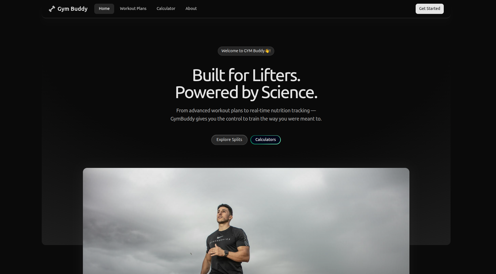
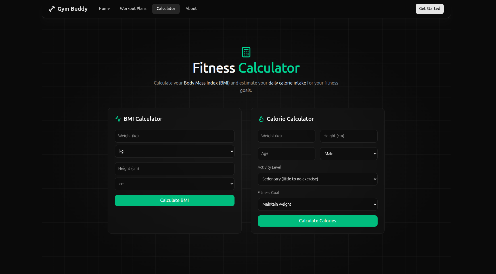

<p align="center">
  
</p>

A modern web app that helps gym-goers follow structured workout splits and calculate fitness metrics like BMI & calories. This is a **fun learning project** built to explore Next.js, TailwindCSS, shadcn/ui, Cloudflare R2.

## 🔗 Live Demo

**[Live Demo URL](https://viveek-sh.github.io/gym-buddy/)**

## 🚀 Tech Stack

<p align="left">
  
  
  
  
  
  
  
</p>

## 📸 App Snapshots

<table>
  <tr>
    <td></td>
    <td></td>
  </tr>
</table>

## 🧠 Features

- Create and follow structured workout splits
- Calculate and track BMI
- Compute daily calorie needs and track calorie intake
- Responsive layout - works well on desktop and mobile
- Modern, accessible components built with **Shadcn UI**
- Smooth dark-mode-based UI elements

## 📦 Getting Started

### Prerequisites

- Node.js (v16+ recommended)
- npm / yarn / pnpm

1. Clone the repo
   ```bash
   git clone https://github.com/viveek-sh/gym-buddy.git
   cd gym-buddy
   ```
2. Run Using Docker
   ```bash
   docker build -t gym-buddy .
   docker run -d -p 3000:3000 --name gym-buddy gym-buddy
   ```
   > The app is now live at: http://localhost:3000
3. or Run Using Node
   ```bash
   npm install
   npm build
   npm start
   ```
   > The app is now live at: http://localhost:3000

## 🧱 Project Structure

- /app → Next.js routes & pages
- /components → UI + shadcn components
- /screens → View screens
- /lib → Utility helpers
- /public → Static assets


> 💪Gym-Buddy - a fun learning project built with modern tools and a passion for fitness.
